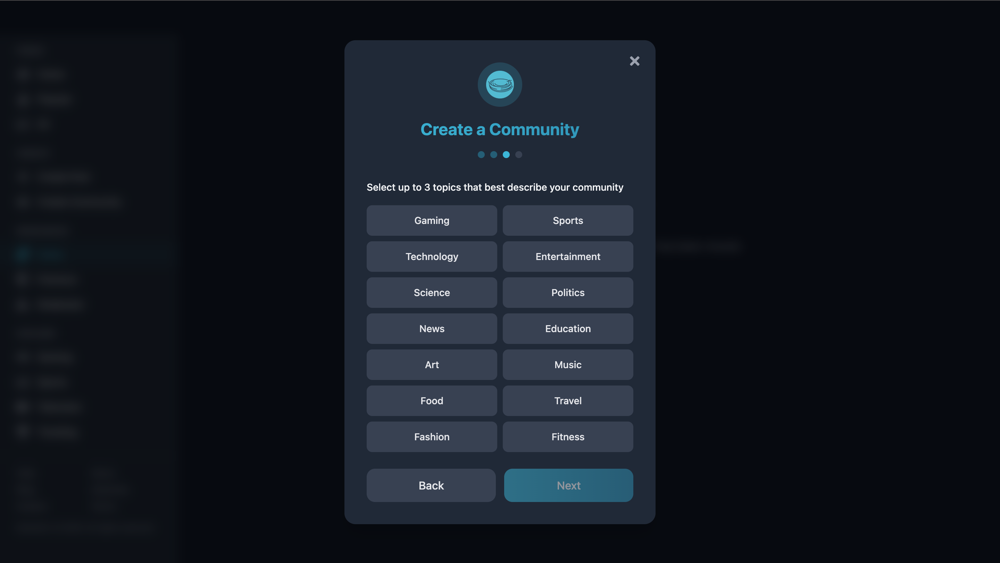
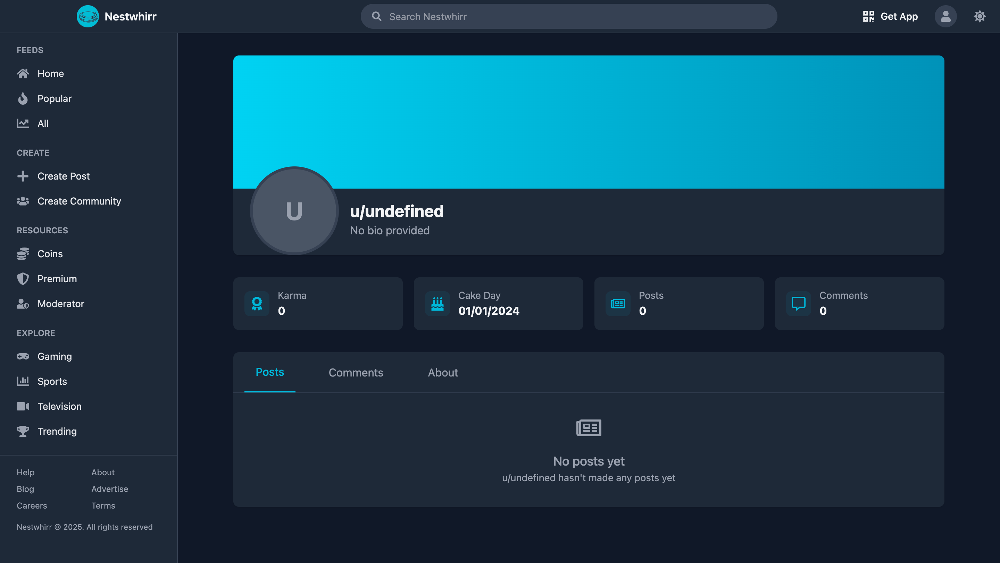

## Overview

Nestwhirr is a Reddit-style community platform for creating and joining communities, sharing posts (text/image/link), engaging in threaded discussions with voting, and managing user profiles — all in a responsive light/dark web experience with protected flows for authenticated users.

---

## Table of Contents
- [Technologies](#technologies)
- [Features](#features)
- [Screenshots](#screenshots)
- [License](#license)

---

## Technologies
- Frontend: React, Vite, Tailwind CSS, Framer Motion, React Query
- Backend: Node.js, Express
- Database: MongoDB
- Auth: Firebase (Auth), backend session/validation
- Validation: Joi
- Cache / Queue: Redis
- Dev / Ops: Docker (used in project), but instructions below use npm scripts
- Other: JWT, Multer (file upload), bcrypt

---

## Features
- Anonymous + authenticated browsing
- Email/password + Firebase authentication flow
- Create / browse / search communities (subnests)
- Create posts: text, image, link
- Post feed with sorting, pagination
- Post details page with nested comments, comment creation
- Upvote/downvote system and simple karma
- Create community multi-step flow (4-step)
- User profile with posts & stats
- Responsive UI with light/dark theme
- Protected routes for creating posts / communities

---

## Screenshots

#### Note: The screenshots below are full-page captures designed to showcase the entire page layout.

### Home — Light / Dark / Mobile

| Home — Light | Home — Dark | Home — Mobile |
| ------------ | ----------- | ------------- |
|  |  |  |

### Authentication — Login / Register

| Login | Register |
| ----- | -------- |
|  |  |

### Home (Authenticated) — Desktop / Mobile

| Authenticated Home — Desktop | Authenticated Home — Mobile |
| --------------------------- | --------------------------- |
|  |  |

### Create Post — Text / Image / Link

| Create Post — Text | Create Post — Image | Create Post — Link |
| ------------------ | ------------------- | ------------------- |
|  |  |  |

### Create Community — Step 1 / Step 2 / Step 3 / Step 4

| Create Community — Step 1 | Create Community — Step 2 | Create Community — Step 3 | Create Community — Step 4 |
| ------------------------- | ------------------------- | ------------------------- | ------------------------- |
|  |  |  |  |

### Community Page / Single Post (with comments)

| Community Page | Single Post (with comments) |
| -------------- | --------------------------- |
|  |  |

### User Profile / Mobile Navigation (Sidebar)

| User Profile | Mobile Navigation / Sidebar |
| ------------ | --------------------------- |
|  |  |

---

### License

